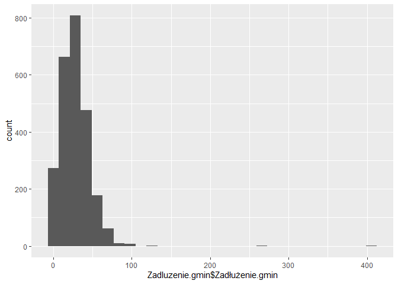

Lab4: Testowanie hipotez
================
Dzmitry Navumau
March 2024

**Zadanie 1.** Dane zebrane przez zespół wskazują, że przed rokiem 2000
*R. longicorn* zamieszkujące składy drewna stanowiły 0.40 wszystkich
wystąpień tego owada. Po 2000 liczba ta wzrosła do 0.76.  
Chcemy zweryfikować za pomocą testu niezależności chi-kwadrat, czy wybór
siedliska zależy od okresu.

Aby przeprowadzić test niezależności chi-kwadrat, musimy najpierw
obliczyć *tabelę kontyngencji*, podsumowującą liczby wystąpień *R.
longicorn* w różnych siedliskach w zależności od okresu:

| Liczba wystąpień    | Przed 2000 r. | Po 2000 r. |
|---------------------|---------------|------------|
| Skład drewna        | $O_{11}$      | $O_{12}$   |
| Siedlisko naturalne | $O_{21}$      | $O_{22}$   |

Wiemy, że zbadano $N=110$ wystąpień owada, a 66.7% spośród nich było w
składzie drewna. Żeby uzupełnić tabelę kontyngencji musimy jeszcze
obliczyć procent owadów znalezionych przed rokiem 2000.

Oznaczmy przez $A$ zdarzenie polegające na tym, że losowo wybrany owad
zamieszkuje skład drewna, a przez $B$ zdarzenie, że losowo wybrana
obserwacja jest sprzed roku 2000. Zdarzenie przeciwne oznaczmy przez
$B'$.  
Korzystając ze *wzoru na prawdopodobieństwo całkowite* możemy teraz
napisać
$$\mathbb{P}(A) = \mathbb{P}(A | B) \mathbb{P}(B) + \mathbb{P}(A | B') \mathbb{P}(B') = \mathbb{P}(A | B) \mathbb{P}(B) + \mathbb{P}(A | B') (1 - \mathbb{P}(B)).$$
Zwróćmy uwagę, że z treści zadania znamy zarówno $\mathbb{P}(A | B)$,
jak i $\mathbb{P}(A | B')$ – jest to odpowiednio 0.40 i 0.76. Mamy zatem
$$ 0.667 = 0.40 \mathbb{P}(B) + 0.76 (1 - \mathbb{P}(B)),$$ a po
przekształceniu tej równości otrzymujemy
$\mathbb{P}(B) = (0.667 - 0.76)/(0.4 - 0.76) \approx 0.26$.

W tabeli kontyngencji oznaczyliśmy $O_{11}$ jako liczbę owadów
znalezionych w składzie drewna przed rokiem 2000.  
Obliczymy tę wartość jako $N\mathbb{P}(A \wedge B)$. Prawdopodobieństwo
zajścia obu zdarzeń naraz, $\mathbb{P}(A \wedge B)$, obliczymy
korzystając z *reguły łańcuchowej* jako
$$\mathbb{P}(A \wedge B) = \mathbb{P}(A | B) \mathbb{P}(B) = 0.40 \cdot 0.26 = 0.1033.$$
Wobec tego na podstawie danych z zadania mamy
$O_{11} = 110*0.1033 = 11.36$, co zaokrąglamy do 11.

Pozostałe elementy macierzy kontyngencji obliczamy analogicznie.

``` r
contingency_table<- matrix(c(11, 17, 62, 20), nrow = 2)
wynik <- chisq.test(contingency_table, correct=F)
wynik
```

    ## 
    ##  Pearson's Chi-squared test
    ## 
    ## data:  contingency_table
    ## X-squared = 12.338, df = 1, p-value = 0.0004439

Na podstawie wyniku testu chi-kwadrat można stwierdzić, że istnieje
statystycznie istotna zależność między zmiennymi w badanej tabeli
kontyngencji. Zmienne te nie są niezależne od siebie, a ich związek jest
znaczący na poziomie istotności poniżej 0.05.

**Zadanie 2.** *Przygotowanie danych.*  
Zaczniemy od wczytania danych znajdujące się w pliku
`Zadluzenie gmin.csv` i przygotujemy je dla dalszej analizy:

``` r
Zadluzenie.gmin <- read.delim("E:/Study/MIMUW/6 semestr/SAD/Repositories/Lab-3-Confidence-interval/Data/Zadluzenie gmin.csv", colClasses = c('factor', 'factor', 'factor', 'numeric', 'factor', 'factor'))
```

Dodajmy nowa kolumna z wyciętym początkiem kodu a na jej podstawie
kolumnę z nazwą wojewodstwa:

``` r
library(stringr)
Zadluzenie.gmin$Kod.Skrót <- str_sub(Zadluzenie.gmin$Kod.Teryt, 0, 2)

slownik <- c('02' = 'Dolnośląskie', '04' = 'Kujawsko-pomorskie',
             '06' = 'Lubelskie', '08' = 'Lubuskie',
             '10' = 'Łódzkie', '12' = 'Małopolskie',
             '14' = 'Mazowieckie', '16' = 'Opolskie', 
             '18' = 'Podkarpackie', '20' = 'Podlaskie',
             '22' = 'Pomorskie', '24' = 'Śląskie',
             '26' = 'Świętokrzyskie', '28' = 'Warmińsko-mazurskie',
             '30' = 'Wielkopolskie',  '32' = 'Zachodniopomorskie')

Zadluzenie.gmin$Nazwa.wojewodztwa <- slownik[Zadluzenie.gmin$Kod.Skrót]
```

Predstawmy dane na wykresie:

``` r
library(ggplot2)
ggplot() + geom_histogram(aes(x=Zadluzenie.gmin$Zadłużenie.gmin))
```

    ## `stat_bin()` using `bins = 30`. Pick better value with `binwidth`.

<!-- -->

Wyrzucamy outliery(dane które mogą przekadzać istotności wyników
analizy):

``` r
Zadluzenie.gmin[Zadluzenie.gmin$Zadłużenie.gmin>100,]
```

    ##         Region Kod.Teryt    Kod.BDR Zadłużenie.gmin Jednostka Okres Kod.Skrót
    ## 2474   Nowinka   2001052 3203901052        102.0415         %  2015        20
    ## 2475 Myślenice   1209033 2122009033        129.1638         %  2015        12
    ## 2476   Bielice   3212012 4326412012        130.4456         %  2015        32
    ## 2477     Rewal   3205072 4326405072        264.7442         %  2015        32
    ## 2478 Ostrowice   3203042 4326303042        405.6593         %  2015        32
    ##       Nazwa.wojewodztwa
    ## 2474          Podlaskie
    ## 2475        Małopolskie
    ## 2476 Zachodniopomorskie
    ## 2477 Zachodniopomorskie
    ## 2478 Zachodniopomorskie

``` r
Zadluzenie.gmin <- Zadluzenie.gmin[-(2474:2478),]
```

**Zadanie 3.** Czy na podstawie danych możemy stwierdzić, że średnie
zadłużenie gminy w województwie mazowieckim jest mniejsze niż 25%?
Wykorzystajmy dla weryfikacji tego jednopróbkowy test t Studenta przy
hipotezach $H_0: \mu = 25$, $H_1 : \mu < 25$.

``` r
mazowieckie <- Zadluzenie.gmin[Zadluzenie.gmin$Nazwa.wojewodztwa == "Mazowieckie", ]
n <- length(mazowieckie$'Zadłużenie.gmin')
mean_zero <- 25
mean_mazowieckie <- mean(mazowieckie$'Zadłużenie.gmin')
sd_mazowieckie <- sd(mazowieckie$'Zadłużenie.gmin')
t <- (mean_mazowieckie - mean_zero) / (sd_mazowieckie)*sqrt(n)

stopnie <- n - 1
p_value <- pt(t, stopnie)
t.test(mazowieckie$'Zadłużenie.gmin', mu = mean_zero, alternative = "less")
```

    ## 
    ##  One Sample t-test
    ## 
    ## data:  mazowieckie$Zadłużenie.gmin
    ## t = -0.68241, df = 313, p-value = 0.2477
    ## alternative hypothesis: true mean is less than 25
    ## 95 percent confidence interval:
    ##      -Inf 25.87259
    ## sample estimates:
    ## mean of x 
    ##  24.38443

Ponieważ p-wartość jest duża, to nie mamy podstaw żeby uznać że średnie
zadłużenie jest mniejsze niż 25%.

**Zadanie 4.** Wezmy dane dotyczące województw łódzkiego i pomorskiego.
Przy założeniu, że rozkład zadłużenia jest normalny, będziemy testować
hipotezę, że wariancja zadłużenia w każdej z tych gmin jest równa
$\sigma_0^2 = 226$. Hipoteza alternatywna to $H_1 : \sigma^2 \neq 15$.

W tym teście obliczanie p-wartości jest nieco bardziej skomplikowane.
Mamy do czynienia z alternatywą dwustronną, i nie wiemy, czy statystyka
testowa będzie przyjmować wartości nietypowo niskie, czy nietypowo
wysokie. Jednym ze sposobów, w jaki można sobie z tym poradzić, to
obliczenie p-wartości jako
$$ p = 2\min\{\mathbb{P}(X < x),\ \mathbb{P}(X > x) \},$$ gdzie $X$ to
statystyka testowa, $x$ to jej zaobserwowana wartość, a
prawdopodobieństwo obliczamy przy założeniu hipotezy zerowej.

``` r
lodzkie <- Zadluzenie.gmin[Zadluzenie.gmin$Nazwa.wojewodztwa == 'Łódzkie', ]
pomorskie <- Zadluzenie.gmin[Zadluzenie.gmin$Nazwa.wojewodztwa == 'Pomorskie', ]
lodzkieChisq <- (nrow(lodzkie)-1)*var(lodzkie$Zadłużenie.gmin)/226 #trochę inaczej niż na slajdach, bo na slajdach obciążony, a tu nie
lodzkie_p <- 2*min(pchisq(lodzkieChisq, nrow(lodzkie)-1), 1-pchisq(lodzkieChisq,  nrow(lodzkie)-1))
pomorskieChisq <- (nrow(pomorskie) - 1)*var(pomorskie$Zadłużenie.gmin)/226
pomorskie_p <- 2*min(pchisq(pomorskieChisq, nrow(pomorskie)-1), 1-pchisq(pomorskieChisq,  nrow(pomorskie)-1))
```

``` r
library(EnvStats)
```

    ## 
    ## Присоединяю пакет: 'EnvStats'

    ## Следующие объекты скрыты от 'package:stats':
    ## 
    ##     predict, predict.lm

``` r
varTest(lodzkie$Zadłużenie.gmin, sigma= 226)
```

    ## 
    ## Results of Hypothesis Test
    ## --------------------------
    ## 
    ## Null Hypothesis:                 variance = 226
    ## 
    ## Alternative Hypothesis:          True variance is not equal to 226
    ## 
    ## Test Name:                       Chi-Squared Test on Variance
    ## 
    ## Estimated Parameter(s):          variance = 226.5667
    ## 
    ## Data:                            lodzkie$Zadłużenie.gmin
    ## 
    ## Test Statistic:                  Chi-Squared = 176.4413
    ## 
    ## Test Statistic Parameter:        df = 176
    ## 
    ## P-value:                         0.9529225
    ## 
    ## 95% Confidence Interval:         LCL = 185.7897
    ##                                  UCL = 282.4918

``` r
varTest(pomorskie$Zadłużenie.gmin, sigma=226)
```

    ## 
    ## Results of Hypothesis Test
    ## --------------------------
    ## 
    ## Null Hypothesis:                 variance = 226
    ## 
    ## Alternative Hypothesis:          True variance is not equal to 226
    ## 
    ## Test Name:                       Chi-Squared Test on Variance
    ## 
    ## Estimated Parameter(s):          variance = 225.6837
    ## 
    ## Data:                            pomorskie$Zadłużenie.gmin
    ## 
    ## Test Statistic:                  Chi-Squared = 121.8292
    ## 
    ## Test Statistic Parameter:        df = 122
    ## 
    ## P-value:                         0.9746602
    ## 
    ## 95% Confidence Interval:         LCL = 178.2516
    ##                                  UCL = 295.0419

ponieważ dostaliśmy bardzo wysokie wartości p-value, nie mamy podstaw do
odrzucenia hipotezy zerowej.

**Zadanie 5.** Odpowiemy sobie na pytanie: czy na podstawie danych
możemy stwierdzić, że przeciętna gmina z Pomorskiego jest zadłużona
bardziej niż z Łódzkiego?  
Wykorzystamy w tym celu test t Studenta dla populacji o różnych
licznościach, ale równych wariancjach

Ponieważ interesują nas zarówno nietypowo wysokie jak i niskie wartości
statystyki testowej, a rozkład tej ostatniej jest symetryczny względem
zera, robimy to następująco:
$$p = \mathbb{P}(|X| > |x|) = \mathbb{P}(X > |x|) + \mathbb{P}(X < -|x|) = 2\mathbb{P}(X < -|x|).$$

``` r
Sp <- ((nrow(pomorskie)-1)*var(pomorskie$Zadłużenie.gmin) + (nrow(lodzkie)-1)*var(lodzkie$Zadłużenie.gmin))/(nrow(pomorskie) + nrow(lodzkie)-2)
X <- (mean(pomorskie$Zadłużenie.gmin) - mean(lodzkie$Zadłużenie.gmin))/sqrt(Sp*(1/nrow(lodzkie) + 1/nrow(pomorskie)))
my_p_value <- 2*pt(-abs(X), nrow(pomorskie) + nrow(lodzkie)-2)
```

``` r
test_result <- t.test(pomorskie$Zadłużenie.gmin, lodzkie$Zadłużenie.gmin, var.equal=T)
test_result$p.value
```

    ## [1] 0.007724569

ponieważ p-wartość bardzo niska, ODRZUCAMY H_0 (czyli mamy jednak różne
średnie)

**Zadanie 6(dodatkowe).** Wybierzmy dwa województwa: małopolskie oraz
śląskie. Zweryfiujmy hipotezę o tym, że średnie zadłużenie gmin z tych
województw jest równe, za pomocą dwupróbkowego testu t Studenta dla prób
o różnych rozmiarach i wariancjach. Hipoteza alternatywna w tym
przypadku jest taka, że średnie zadłużenia są różne

``` r
malopolskie <- Zadluzenie.gmin[Zadluzenie.gmin$Nazwa.wojewodztwa == 'Małopolskie', ]
slaskie <- Zadluzenie.gmin[Zadluzenie.gmin$Nazwa.wojewodztwa == 'Śląskie', ]

t_test_result <- t.test(malopolskie$Zadłużenie.gmin, slaskie$Zadłużenie.gmin, var.equal = FALSE)
```

Obliczanie statystyki t ręcznie

``` r
n1 <- length(malopolskie$Zadłużenie.gmin)
n2 <- length(slaskie$Zadłużenie.gmin)
s1 <- sd(malopolskie$Zadłużenie.gmin)
s2 <- sd(slaskie$Zadłużenie.gmin)
x1_bar <- mean(malopolskie$Zadłużenie.gmin)
x2_bar <- mean(slaskie$Zadłużenie.gmin)

t_stat <- (x1_bar - x2_bar) / sqrt(s1^2/n1 + s2^2/n2)
```

Obliczanie stopni swobody

``` r
df <- ((s1^2/n1 + s2^2/n2)^2) / ((s1^2/n1)^2/(n1 - 1) + (s2^2/n2)^2/(n2 - 1))
```

Obliczanie p-wartości

``` r
p_value <- 2 * pt(-abs(t_stat), df)
```

Porównanie z wynikiem z funkcji t.test

    ## Ręcznie obliczona p-wartość: 0.1997576 
    ## P-wartość z t.test: 0.1997576
